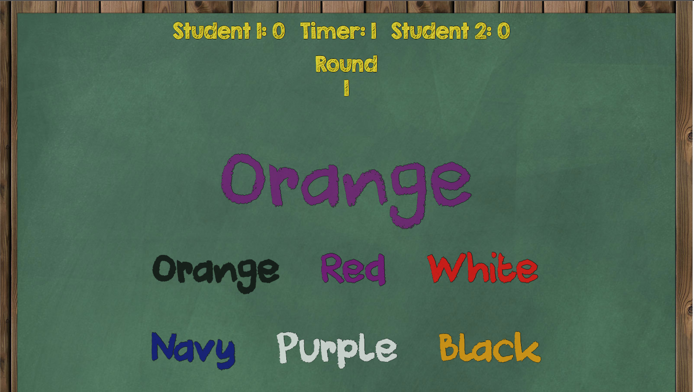

#Right Brain V. Left Brain

###Installation
None, play [here](http://zkao04.github.io/Project-1/)

###Overview
A two player interactive game aiming to develop users' ability to focus, concentrate, and relax.

###Rules
1. The game start off with a color phrase at the top and three with smaller fonts right below

2. Each phrases are styled with actual colors: "red, white, and blue"

3. Player must identify the "actual color" of the word at top, not the word of the color and click on one of the three corresponding word of the color at the bottom.

4. Clicking on the correct answer will grant the player a score of +1, follow by next player's turn

5. Clicking on the wrong answer will grant the player a socre of -1, follow by next player's turn

6. Each player have five seconds to click on the correct answer, if player did not act within the 5 seconds, the game automatically moves on to next player's turn 

7. The game will end after each player have gone through 5 rounds and determines the winner based on scores

###Technologies used
HTML, CSS, Javascript, Jquery, Trello

###Credits
This game is basically a remake of an Android app published by [Hamster On Coke Games](http://hamsteroncoke.com/press/)

Random Quote Generator and quotes are from 
[codepen](http://codepen.io/kkoutoup/pen/zxmGLE)

###Fonts

**[DK Cool Crayon](http://www.fontspace.com/category/chalkboard) by David Kerkhoff
	

**[KG Life is Messy](http://www.fontspace.com/category/chalkboard) by Kimberly Geswein
	
	
**[KG Second Chances Solid](ttp://www.fontspace.com/category/chalkboard) by Kimberly Geswein
	
	
**[KG Ten Thousand Reasons](http://www.fontspace.com/category/chalkboard) by Kimberly Geswein
	
	
	
	
###Future Updates

*_Tutorial Stage_

*_Setting Easy, Medium, and Hard Difficulty_

*_Adding replay value_(better sound and animation, with animating distraction)

*_Store score so it's accumulated after reload_

*_CSS Responsive so it can be played on 

###Screen Shot

